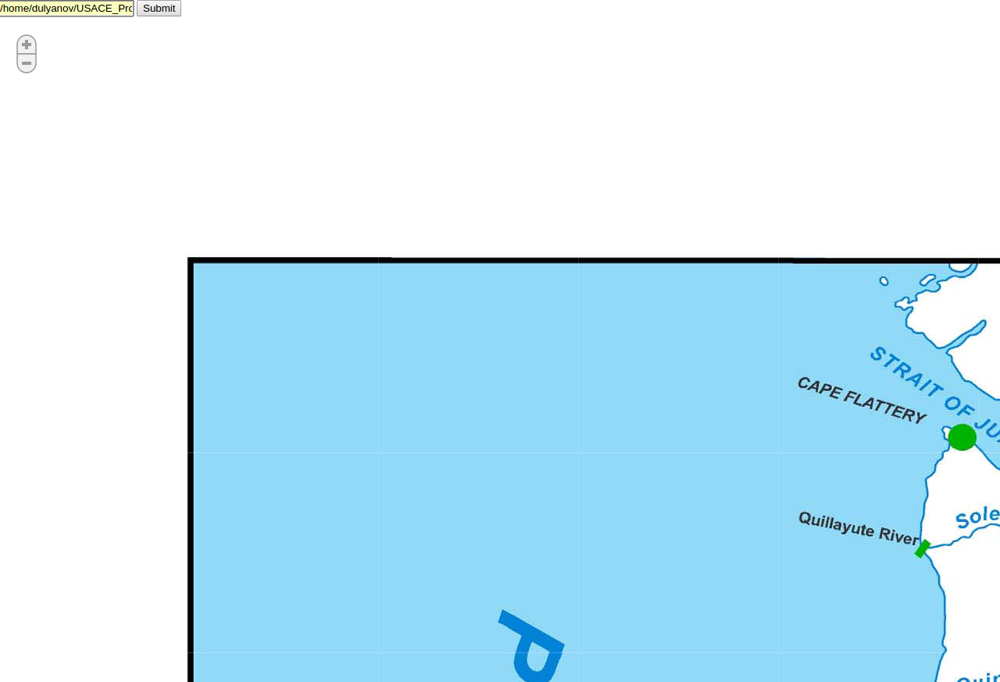

# Large image viewer
This is web-based image viewer with a support of arbitrary large images. The image is first broke down into small patches at multiple scales. It allows to load image by parts, exactly as Google Maps loads only part of the map that you look at, at resolution you have.

<table>
    <tr>
        <td>
          
        </td>

         <td>
        

        </td>
    </tr>
</table>

# Usage

Start viewer with
```
python viewer.py
```

Then open browser at `http://localhost:5123/` and select an image and wait until it is tiled.

# Known issues
I sometimes experience some caching problems in Chromium: old image tiles are not completely replaced by the new ones. In this case [This post](https://superuser.com/a/406331) helped me.

# References
[Kaggle plankton visualization](https://github.com/ebenolson/kaggle-ndsb-visualization)

[Polymaps](http://polymaps.org/ex/)
